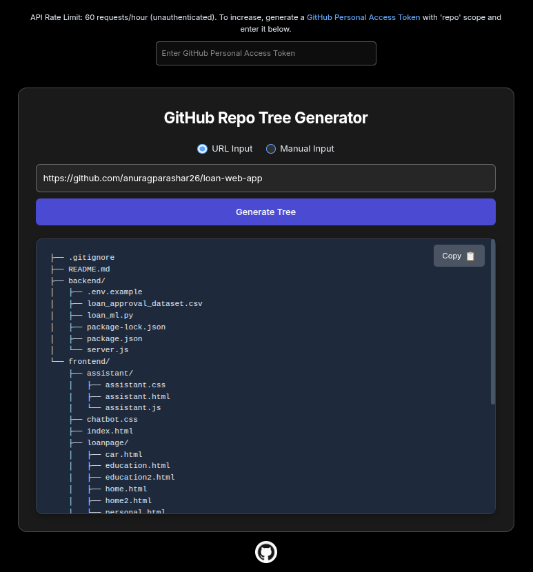

# GitHub Repo Tree Generator

Generate a clean, markdown-formatted directory tree of any GitHub repository directly from your browser.



## 🔍 Features

- 🌲 Generates a visual tree of all files and folders
- 🔗 Accepts both GitHub URLs and manual owner/repo inputs
- 🔐 Supports GitHub Personal Access Token (PAT) for increased API limits
- 📋 One-click copy of the generated markdown tree
- ⚡ Built with **React + Vite + TypeScript**

## 🛠️ Getting Started

```bash
# Clone the repository
git clone https://github.com/anuragparashar26/github-repo-tree-generator.git

# Navigate to the project directory
cd github-repo-tree-generator

# Install dependencies
npm install

# Start the development server
npm run dev
```

## 🔐 GitHub API Rate Limits

- Unauthenticated: **60 requests/hour**
- Authenticated with PAT: **5,000 requests/hour**

To increase the limit:

1. [Generate a GitHub PAT](https://github.com/settings/tokens?type=beta)
2. Select the `repo` scope
3. Paste the token in the input field at the top of the app
